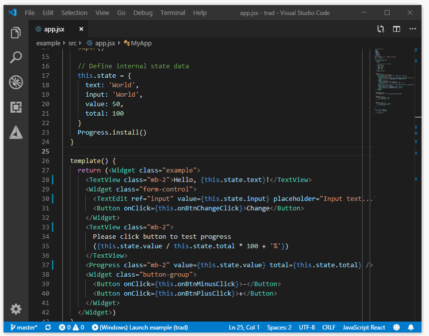

# Trad

## 介绍

(**中文**/[English](README.md))

Trad 是一个专为简化 C 开发而设计的编程语言，它：

- **基于 C：** 经编译器编译后能得到干净可读的标准 C 代码，其与 C 的关系就像 TypeScript 与 JavaScript 一样
- **专为 UI 优化：** 使用专为构建 UI 而设计的语法特性让构建 UI 变得更加容易
- **易于使用：** 针对 C 开发者的使用习惯而设计，无需花费大量时间查阅复杂的文档就能快速上手
- **不可用于生产：** 当前版本仅供技术交流，内部架构设计还未稳定，不适合在正式的产品中应用
- **由社区驱动：** 体积小，易于阅读和修改，任何人都可以参与制定语言规范，项目的发展状态受社区活跃度影响
- **跨平台：** 支持 Linux 和 Windows 桌面端，但不支持 Mac OS、移动端

Trad 的语法基于 JavaScript，它与现有的 JavaScript 开发工具/编辑器扩展有着良好的兼容性，而且在很长的一段时间内不会有重大变化，所以，你可以暂时将它当作 JavaScript 来写。

## 安装

    npm install -g tradlang

## 使用

编译为 C 源码文件：

    tradc example.jsx

编译 C 源码文件为可执行文件：

    gcc -c example.jsx.c
    gcc -o example example.jsx.o -lLCUI

**注意：** Trad 应用的 UI 层由 [LCUI](https://github.com/lc-soft/LCUI) 提供支持，在编译前请安装它。

当前版本仅实现了最小示例应用所需的功能，并不能应用在实际项目中，请等待后续更新。

## 贡献

有很多方式[参与贡献](CONTRIBUTING.zh-cn.md) Trad：

- [反馈问题](https://github.com/lc-soft/trad/issues)并在问题关闭时帮助我们验证它们是否已经修复
- 参与功能设计相关问题的投票和讨论
- 审查[源代码的改动](https://github.com/lc-soft/trad/pulls)
- 在 [开源问答](https://www.oschina.net/question/ask)、[思否](https://segmentfault.com/)上与其他 Trad 用户和开发人员交流
- [修复已知问题](CONTRIBUTING.zh-cn.md)
- 阅读[语言规范文档](docs/README.md)

本项目采用了参与者公约定义的行为准则，该文档应用于许多开源社区，有关更多信息，请参阅[《行为准则》](CODE_OF_CONDUCT.zh-cn.md)。

## 路线图

以下只列出了主要的任务，如需了解详细的任务计划和进度，请查看[项目看板](https://github.com/lc-soft/trad/projects)。

- 核心
  - 基础语法
  - 基础数据类型
  - 兼容 C 的语法
  - 模板字符串
  - 闭包
  - 装饰器
  - await/async
  - 标准库
- LCUI 扩展
  - 重新设计 LCUI 的语言绑定
  - 实现 Widget.render() 方法
  - `@UIThread` 装饰器
- 工具链
  - 编译器
    - 命令行界面（CLI）
    - 友好的错误输出
    - 行注释
  - 包管理器
  - 构建工具
- 文档
  - 常见问题及解答
  - 语言规范
  - 教程

## 许可

代码基于 [MIT 许可协议](LICENSE) 发布。
